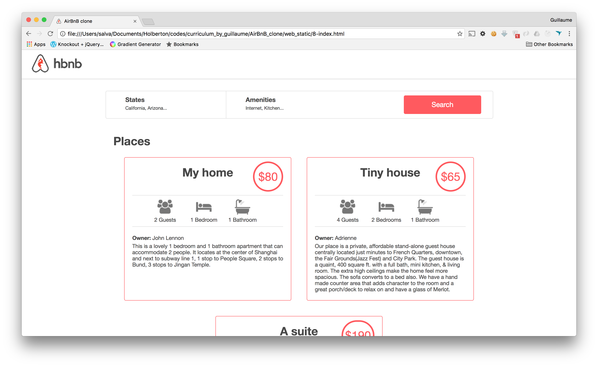
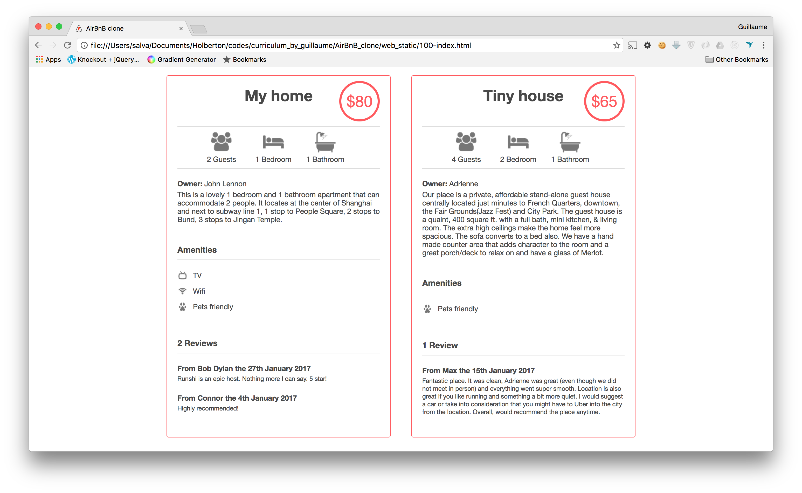

# AirBnB Clone - The Console


## Project Overview

This is a group project to build the first step of the AirBnB clone, focusing on creating a command interpreter in Python. The project involves implementing object management, serialization, and deserialization, as well as creating classes for various AirBnB objects like User, State, City, and Place. The goal is to establish a foundation for future development, including HTML/CSS templating, database storage, API integration, and front-end implementation.

### Project Details

- **Group Members:** AKRAM BOUTZOUGA, Kawtar LazraK 

### Concepts to Explore

- Python packages
- AirBnB clone
- cmd module
- OOP (Object-Oriented Programming)
- Python unittest
- Serialization and deserialization
- File storage
- UUID (Universal Unique Identifier)
- *args and **kwargs
- Datetime handling

## Learning Objectives

Upon completion of this project, you should be able to:

1. Create a Python package
2. Develop a command interpreter using the cmd module
3. Implement Unit testing in a large project
4. Serialize and deserialize a class
5. Read and write JSON files
6. Manage datetime in Python
7. Understand the concept of UUID
8. Utilize *args and **kwargs in function parameters
9. Handle named arguments in a function

## Copyright and Plagiarism

- Solutions for tasks must be developed independently to meet learning objectives.
- Content of the project is not to be published.
- Plagiarism will result in removal from the program.

## Requirements

### Python Scripts

- **Editors:** vi, vim, emacs
- **Interpreter:** Ubuntu 20.04 LTS, Python 3.8.5
- **File Endings:** Should end with a new line
- **Shebang:** The first line of all files should be `#!/usr/bin/python3`
- **README.md:** Mandatory at the root of the project folder
- **Code Style:** Use pycodestyle (version 2.8.*)
- **Executable:** All files must be executable
- **Documentation:** Modules, classes, and functions should have proper documentation
- **Module/Class/Function Length:** Will be tested using wc

### Python Unit Tests

- **Editors:** vi, vim, emacs
- **File Endings:** Should end with a new line
- **Test Folder:** All test files should be inside a folder named `tests`
- **Unittest Module:** Use the unittest module
- **File Organization:** Follow the project structure in the tests folder
- **Test Execution:** Use `python3 -m unittest discover tests`
- **Documentation:** Modules, classes, and functions should have proper documentation

**Note:** Collaboration on test cases is encouraged to cover edge cases.

## Resources

- [cmd module](https://docs.python.org/3/library/cmd.html)
- [cmd module in depth](https://pymotw.com/3/cmd/)
- [Python packages concept page](https://realpython.com/python-modules-packages/)
- [uuid module](https://docs.python.org/3/library/uuid.html)
- [datetime module](https://docs.python.org/3/library/datetime.html)
- [unittest module](https://docs.python.org/3/library/unittest.html)
- [args/kwargs](https://realpython.com/python-kwargs-and-args/)
- [Python test cheatsheet](https://www.pythonsheets.com/notes/python-tests.html)
- [cmd module wiki page](https://en.wikipedia.org/wiki/Cmd_(computing))
- [python unittest](https://docs.python.org/3/library/unittest.html)

## Project Structure
```bash
.
├── models
│   ├── base_model.py
│   ├── user.py
│   └── ... (other AirBnB object classes)
├── tests
│   ├── test_engine 
│       ├── test_file_storage.py
│   ├── test_models
│   │   ├── test_base_model.py
│   │   ├── test_user.py
    │   ├── test_...py 
│   │   └── ... (other test files)
├── README.md
└── ... (other project files)
```
## Execution
#### Your shell should work in both interactive and non-interactive modes. Example:

### Interactive Mode
```bash
$ ./console.py
(hbnb) help

Documented commands (type help <topic>):
========================================
EOF  help  quit

(hbnb) 
(hbnb) 
(hbnb) quit
$

```

### Non-Interactive Mode
```bash
$ echo "help" | ./console.py
(hbnb)

Documented commands (type help <topic>):
========================================
EOF  help  quit
(hbnb) 
$
$ cat test_help
help
$
$ cat test_help | ./console.py
(hbnb)

Documented commands (type help <topic>):
========================================
EOF  help  quit
(hbnb) 
$
```

#### All tests should also pass in non-interactive mode:
```bash
$ echo "python3 -m unittest discover tests" | bash
```


#### FINAL PRODUCT 

